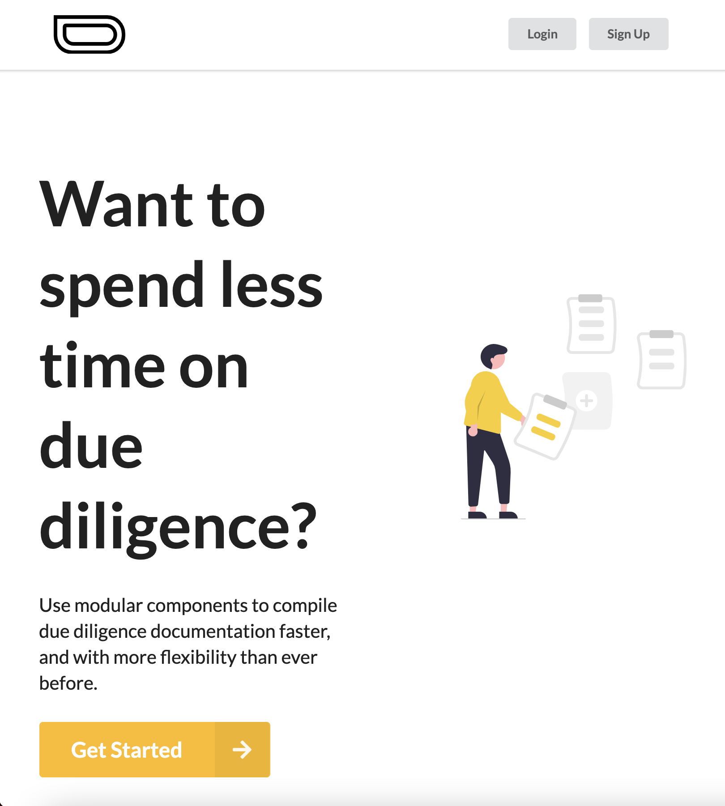
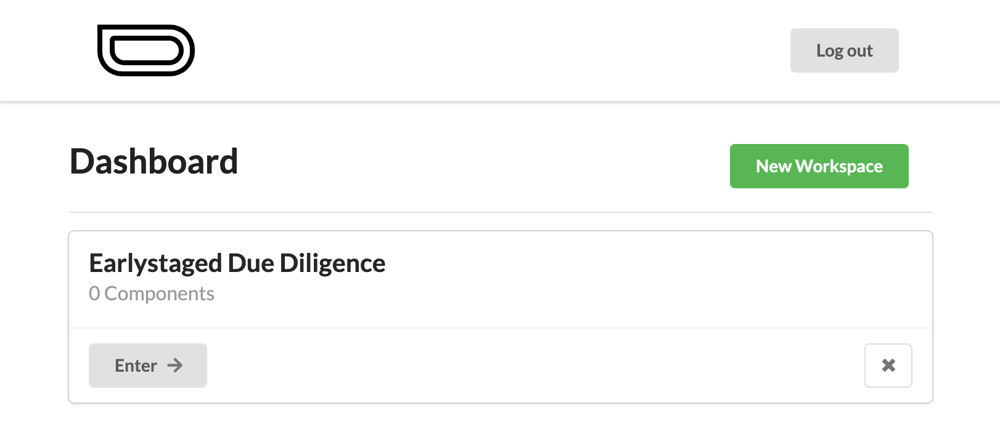
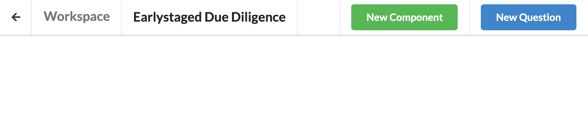
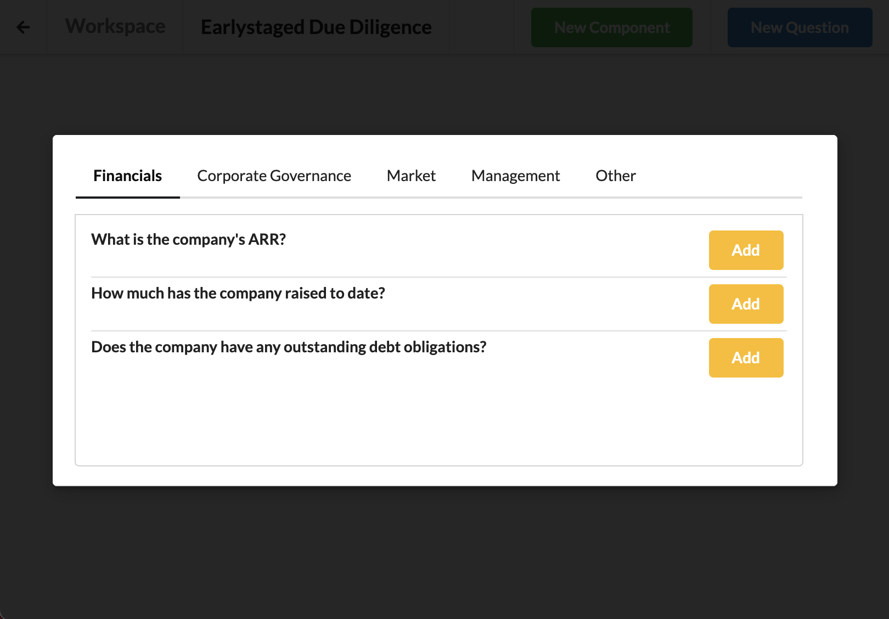
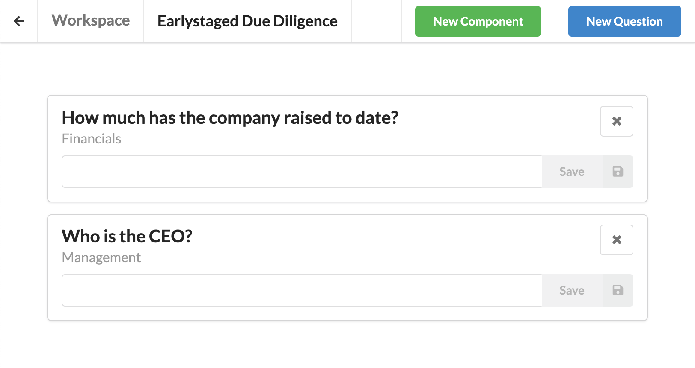
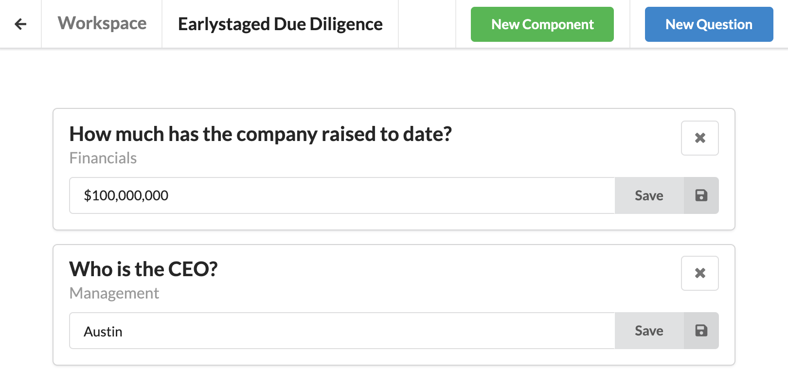
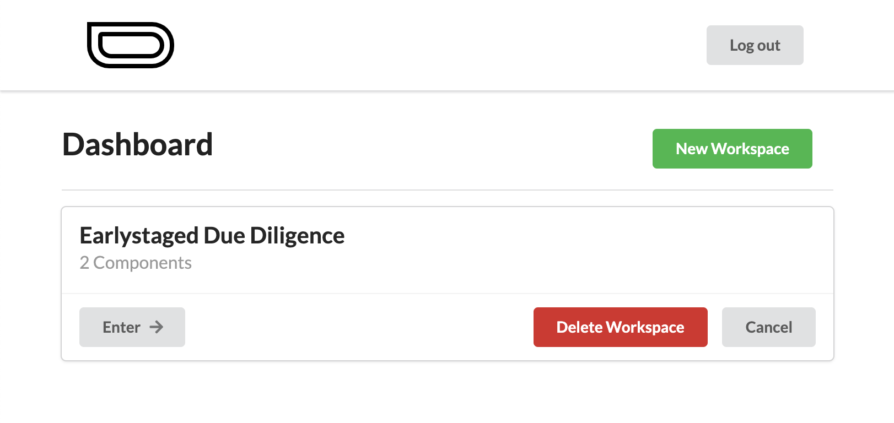

# Earlystaged
A Modular Due Diligence Manager

## Project Overview
### Description
Earlystaged is a due diligence manager focused on providing a modular experience to angel investors and micro VCs. Each user has a dashboard containing a list of due diligence workspaces. A workspace is created form the dashboard page by supplying the name and domain of the company to be evaluated. Once inside, users can create an unlimited number of Q+A Components. Creating a component requires the user to select a question from a list of presets, and then input their answer. Answers can be input or updated at any time, and users can even create custom questions if no presets are available. Once created, that custom quetion will be available across all of the user's workspaces.

### Future Improvements
- Answer Types
- Report Generation + Template Options
- File sharing
- Autosaving with websockets

### Landing Page

### Dashboard

### Empty Workspace

### Creating a Component

### Workspace

### Updating Component

### Deleting Workspace

## Core Dependencies
* Next.js
* React
* Fomantic-UI + (Semantic-UI React Bindings)
* Styled Components

## Get Started
1. clone repo
2. `npm install`
3. `npm run semantic:build`
4. `npm run dev`

