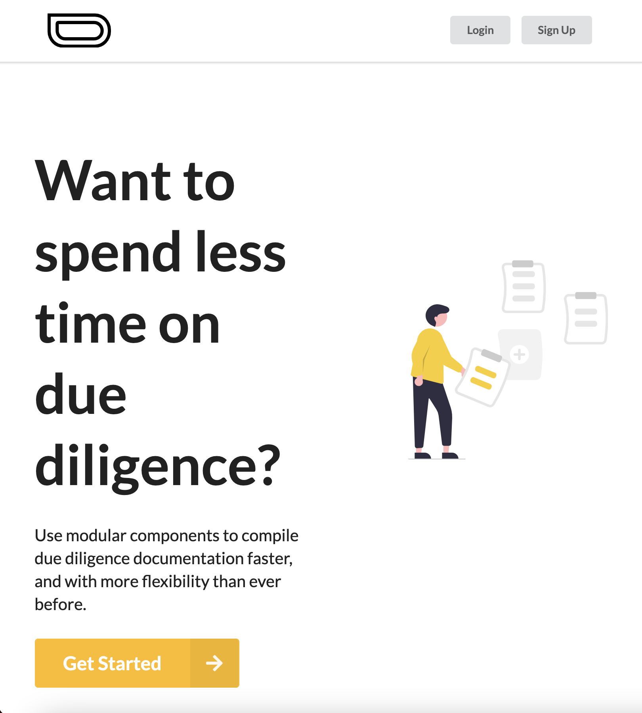

# Earlystaged
A Modular Due Diligence Manager

## Project Overview

### Landing Page

### Dashboard

### Creating a Workspace

### Creating an Component

### Workspace

### Delete Workspace

## Core Dependencies
* Next.js
* React
* Fomantic-UI + (Semantic-UI React Bindings)
* Styled Components

## Get Started
1. clone repo
2. `npm install`
3. `npm run semantic:build`
4. `npm run dev`

